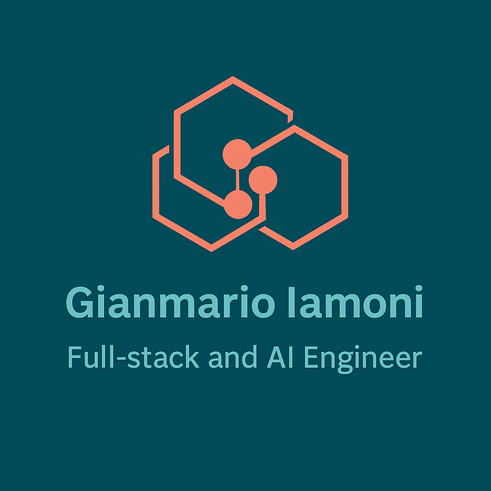

  

 

Crafting scalable, intelligent, end-to-end digital solutions.

---

# 🧩 **About Me**
I'm a full-stack and AI engineer specialized in the **MERN ecosystem with TypeScript**, passionate about building clean, scalable, production-ready web applications.

After years of experience in software engineering and sales engineering, I now focus on:

- **Advanced full-stack architectures (Next.js, Node.js, Supabase)**  
- **AI-powered applications** (LLMs, RAG, LangChain, embeddings, fine-tuning)  
- Creating modern, reliable, and maintainable digital products  

I work remotely with both **Italian and international teams**.

---

# 🧱 **Tech Stack**

### **Core Expertise**

### **Databases**

### **AI & Machine Learning**

---

# 🔥 **Current Projects**

### **1. AI Content Generator (Next.js + RAG + LangChain + OpenAI)**  
A powerful content-creation tool for marketing, rewriting, summarization and SEO automation.

### **2. Smart To-Do App (MERN + TDD + SOLID)**  
Enterprise-grade architecture with clean separation, advanced filters, priority logic and automated tests.

### **3. E-Commerce AI Image Enhancer**  
Image generation & enhancement using diffusion models (SDXL).

### **4. Calendar & Email AI Assistant**  
LLM-powered automation for scheduling, drafting emails, extracting key information, and personalized responses.

---

# 🌟 **Featured Repositories**

<table>
  <tr>
    <td width="45%" valign="top">
      <h3>🤖 <a href="https://github.com/gianmarioiamoni/multi-agent-ai-platform">multi-agent-ai-platform</a></h3>
      
<strong>Multi-agent orchestration for LLM-based workflows.</strong> 
      Playground for coordinating multiple AI agents, tools and memory to solve complex tasks end-to-end.

      

        
        
        
      

      

        
        
      

    </td>
    <td width="45%" valign="top">
      <h3>📚 <a href="https://github.com/gianmarioiamoni/ai-knowledge-companion">ai-knowledge-companion</a></h3>
      
<strong>AI companion for exploring knowledge bases.</strong> 
      RAG-powered assistant to query, summarize and navigate complex documentation and data sources.

      

        
        
        
      

      

        
        
      

    </td>
  </tr>
  <tr>
    <td width="45%" valign="top">
      <h3>💼 <a href="https://github.com/gianmarioiamoni/PIVABalance">PIVABalance</a></h3>
      
<strong>Tool per la gestione della Partita IVA.</strong> 
      Supporto al tracking di entrate, uscite e saldo per freelance e consulenti.

      

        
        
        
      

      

        
        
      

    </td>
    <td width="45%" valign="top">
      <h3>📈 <a href="https://github.com/gianmarioiamoni/agile-pm">agile-pm</a></h3>
      
<strong>Agile project management toolkit.</strong> 
      Utilities and experiments for managing backlogs, sprints and tasks in agile environments.

      

        
        
        
      

      

        
        
      

    </td>
  </tr>
</table>

---

# 🧭 **Skill Roadmap (2025)**

### **MERN & Full-Stack**
- Advanced Next.js patterns (Server Components, Server Actions)
- Clean Architecture, SOLID, TDD
- Supabase Auth, Edge Functions, Vector Embeddings

### **AI Engineering**
- RAG architectures  
- LangChain pipelines  
- GPT fine-tuning (LoRA, QLoRA)  
- Vector DBs (Supabase, Pinecone)  
- Image generation workflows (SDXL, ControlNet)

---

# 📊 **GitHub Analytics**

---

# ✍️ **Quote of the Day**

  

---

# 📫 **Let’s Connect**
If you're building **web apps, AI tools or SaaS platforms**, I’d love to collaborate.

